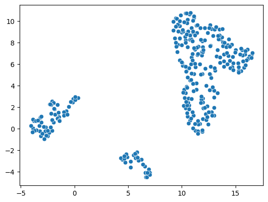
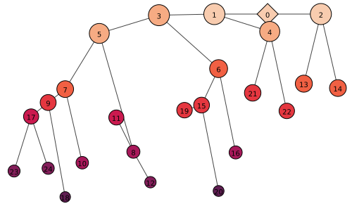
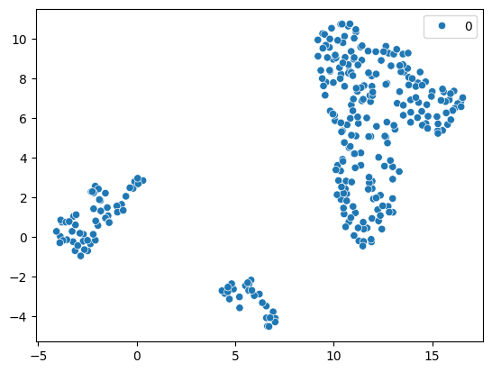
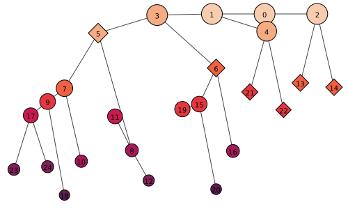
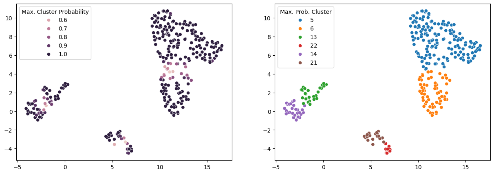
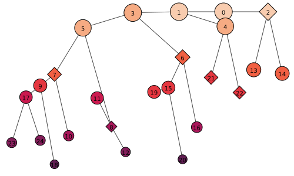
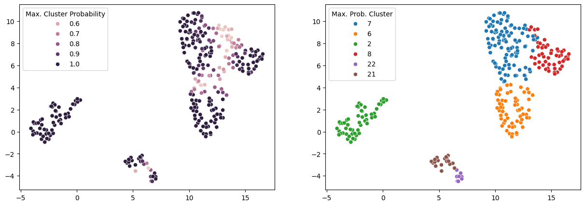
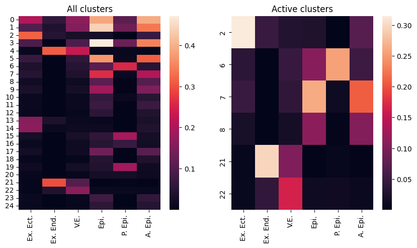

# treeclust

Package to cluster single cell data using Decision Tree Regressors

# Installation

The latest version of the package can be installed with

```
pip install git+https://github.com/gatocor/scTreeClustering
```

# Quickstart

This quickstart follows the example in `example/single-cell.ipynb`.

In this tutorial, we will show the capabilities of the package applying it to a single-cell analysis dataset.

For this tutorial we consider to have already obtained the PCA and KNN graph of the dataset and now we want to cluster the data and find communities using (Leiden)[https://leidenalg.readthedocs.io/en/stable/intro.html] algorithm.

We load the necessary packages, including the `treeclust` package.


```python
import pandas as pd
import numpy as np

import matplotlib.pyplot as plt
import seaborn as sns
import scanpy as sp
import leidenalg

import treeclust as tc
```

And the dataset we are going to analyize.


```python
adata = sp.read_h5ad("../data/pijuan_E6.5_1_processed.h5ad")
```


```python
sns.scatterplot(
    x = adata.obsm["X_umap_pca"][:,0],
    y = adata.obsm["X_umap_pca"][:,1],
    s = 40
)
```


    <Axes: >


    

    


# Create model and train

The initialization of the model is very similar to those of the sklearn.


```python
model = tc.RobustClusteringLeiden(
    #Graph representation, necessary for the leiden clustering
    connectivity_matrix=adata.obsp["neighbors_pca_connectivities"],
    parameter_range=np.arange(0,1,0.001),
)
```

And one create we can fit it.


```python
model.fit()
```

     18%|█▊        | 175/1000 [00:19<01:31,  9.01it/s]


As you can see the method stops before going over all the parameter range because of the early stop criteria.

# Visualize tree clustering

Now we can visualize the tree structure of partitions found by the algorithm. We can put the y position, color and size using different metrics. In this case, since we have just two metrics, we will use just the `connectivity_probability` as a metric for everything.


```python
model.plot_graph(
    y = "connectivity_probability",
    color = "connectivity_probability",
    size = "connectivity_probability",
    size_norm=(30,15),
    bbox=(500,300),
    invert=True
)
```


    

    


This tree represents all the nested clusters partitions found by the algorithm. To make predictions of the clustering we will need to specify a partition configuration of our interest. The current partition is defined by the diamonds and by default starts in the single-cluster partition (cluster 0). 

When we run `model.predict()`, it will predict this will just return the single cluster label for all elements.


```python
sns.scatterplot(
    x = adata.obsm["X_umap_pca"][:,0],
    y = adata.obsm["X_umap_pca"][:,1],
    hue = model.predict()
)
```


    <Axes: >


    

    


# Selecting a clustering candidate

To select another partition, we can call `model.set_threshold(metric, threshold)` to select the clusters based on this metric criteria. 


```python
model.set_threshold(
    metric = "connectivity_probability",
    threshold=0.5
)
```


```python
model.plot_graph(
    y = "connectivity_probability",
    color = "connectivity_probability",
    size = "connectivity_probability",
    size_norm=(30,15),
    bbox=(500,300),
    invert=True
)
```


    

    


Now we can see that the method indicates a new active partition.

> NOTE: 
> The way the method works is that method removes all the nodes below the threshold and then takes those nodes that are closer to a bifurcation.
> For example, in this specific case, clusters 17, 9 and 7 have a `connectivity_probability` above 0.5, however, 23, 24, 18, 10 and 8 do not and 5 is the closest node to a bofurcation in that branch.

We can visualize the new partition using the `model.predict()` or the soft version `model.predict_probability()` from which we show the probability to the most probable cluster.


```python
fig,ax = plt.subplots(1,2,figsize=(15,5))

sns.scatterplot(
    x = adata.obsm["X_umap_pca"][:,0],
    y = adata.obsm["X_umap_pca"][:,1],
    hue = model.predict_probability().max(axis=1),
    ax=ax[0]
)
ax[0].legend(title="Max. Cluster Probability")

sns.scatterplot(
    x = adata.obsm["X_umap_pca"][:,0],
    y = adata.obsm["X_umap_pca"][:,1],
    hue = model.predict().astype(str),
    ax=ax[1]
)
ax[1].legend(title="Max. Prob. Cluster")

fig.show()
```


    

    


# Refining partition

Even if we have several methods and threshold criteria, using a single metric to select a relevant partition can be challenging. The package adds the possibility to fine tune the chosen partition by splits and merges of the clusters in the currect active partition.


```python
model.split(5) #this splits cluster 5 to 6 and 8
model.merge(13) #this considers merging of 13 and 14 back into 2
```


```python
model.plot_graph(
    y = "connectivity_probability",
    color = "connectivity_probability",
    size = "connectivity_probability",
    size_norm=(30,15),
    bbox=(500,300),
    invert=True
)
```


    

    


```python
fig,ax = plt.subplots(1,2,figsize=(15,5))

sns.scatterplot(
    x = adata.obsm["X_umap_pca"][:,0],
    y = adata.obsm["X_umap_pca"][:,1],
    hue = model.predict_probability().max(axis=1),
    ax=ax[0]
)
ax[0].legend(title="Max. Cluster Probability")

sns.scatterplot(
    x = adata.obsm["X_umap_pca"][:,0],
    y = adata.obsm["X_umap_pca"][:,1],
    hue = model.predict().astype(str),
    ax=ax[1]
)
ax[1].legend(title="Max. Prob. Cluster")

fig.show()
```


    

    


# Annotation

Finally, to help giving identities to the different clusters, we can use the partitions along with additional information to name the clusters.

## Prepare an annotation dict

This is a dictionary that contains names and genes associated with each category.


```python
annotation_dict = {
        "Ex. Ect.":{
            "genes":["Bmp4", "Sox2", "Id2", "Sfn", "Cdx2", "Wnt6", "Eomes", "Tfap2c", "Hand1", "Epcam", "Cdh1"],
        },
        "Ex. End.":{
            "genes":["Cubn", "Slc2a2", "Cited1"],
        },
        "V.E.":{
            "genes" : ["Apoe", "Fgf5", "Car4", "Apoa1", "Slc16a1", "Ctsc", "Eomes", "Sox17", "Lhx1","Cer1", "Pitx2", "Foxa2"],
            "AVE" :["Lefty1", "Hesx1", "Otx2", "Krt8", "Ctsc"],
        },
        "Epi.":{
            "genes":["Sox2", "Pou5f1","Fgf5","Slc7a3"],
        },
        "P. Epi.":{
                "genes":["T", "Fgf8", "Fst", "Wnt3", "Nanog"],
            },
        "A. Epi.":{
                "genes":["Pou3f1", "Otx2", "Kpna2", "Utf1", "Tcf15"],
            }
    }

gene_list = []
for i,j in annotation_dict.items():
    gene_list += j["genes"]
gene_list = np.unique(gene_list)
```

## Prepare the marker gene matrix

In addition, we need a pandas DataFrame which contains `elements x genes` used for the annotation.


```python
marker_genes = pd.DataFrame(adata[:,gene_list].X.todense(), columns=gene_list)
```

## Score the clusters

Finally we can generate the scoring.


```python
scoring = model.score_annotation(annotation_dict, marker_genes)
```


```python
fig, ax = plt.subplots(1,2,figsize=(10,5))

sns.heatmap(scoring, ax=ax[0])
ax[0].set_title("All clusters")

sns.heatmap(scoring.iloc[np.sort(model._active_clusters),:], ax=ax[1])
ax[1].set_title("Active clusters")

fig.show()
```


    


# Extending the package (Developers)

## Adding other clustering methods

For creating new classes you just have to create a new class that inherits the `RobustClustering` class and adds any other new properties.

```python
class RobustClusteringLeiden(RobustClustering):

    # Add new properties specific of the class
    partition = None
    
    ...
```

declare a new `__init__` method coping the RobustCluster class.

 - Add initialization arguments for any additional property of your new class

```python
    ...

    def __init__(
        self, 
        connectivity_matrix: np.ndarray, 
        X: Optional[np.ndarray] = None,
        parameter_range: np.ndarray = np.arange(0, 10, 0.1), 
        random_state: int = 0, 
        n_iter: int = 10, 
        stop_criterion: str = "connectivity_probability",
        stop_threshold: float = 0.5, 
        probability_metric: str = "connectivity_probability", 
        additional_metrics: Optional[Dict[str, Callable]] = {
            "connectivity_probability" : connectivity_probability
        },
        marker_genes_matrix: Optional[np.ndarray] = None,
        annotation_dict: Optional[Dict[str, Any]] = None,
        #New arguments
        partition: Type = leidenalg.CPMVertexPartition
    ) -> None:

        #General parameters from RobustClass
        self.X = X
        self.connectivity_matrix = connectivity_matrix
        self.parameter_range = list(parameter_range)
        self.random_state = random_state
        self.n_iter = n_iter
        self.stop_criterion = stop_criterion
        self.stop_threshold = stop_threshold
        self.additional_metrics = additional_metrics
        self.marker_genes_matrix = marker_genes_matrix
        self.annotation_dict = annotation_dict
        self.probability_metric = probability_metric
        
        #Custom elements specific of this class
        self.partition = partition

    ...
```

Finally, create a `_find_clustering` function that takes a clustering parameter and a random seed and returns a partition of the data in form of a list with of the same length as the data.

```python 
    def _find_clustering(self, resolution: float, seed: int) -> List[int]:

        return leidenalg.find_partition(self._clustering_object, self.partition, resolution_parameter=resolution, seed=seed).membership

```

## Adding metrics

If additional metrics want to be used to quantify the quality of a clustering, you can add your own, in a functions like this:

```python 
def connectivity_probability(v: Union[np.ndarray, spmatrix], obj: Any) -> np.ndarray:

    return normalize(object.connectivity_matrix.dot(v))
```

Where the first argument is a 1/0 matrix of `variables x cluster` having 1 in the variable and cluster the cell has been assigned. The `obj` is any extension of the base `RobustClustering` class (e.g. `RobustClusteringLeiden`) and any of its arguments can be used. usually, a metric will use the matrix `X` or the connectivity `connectivity_matrix`. More examples can be seen in [`metrics`]()